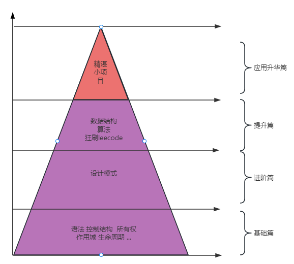

**开篇词**

**要干嘛**：写一个Rust系列

**啥目的**：带大家学习未来语言Rust :smile:

**系列叫啥名字**：拥抱未来语言Rust

**发文时间**：每周六和每周日:laughing:

**预计章节**：60回

**互动方式**：微信群和公众号(文末有加入方式)

##### 整个系列布局：
- 第一部分：Rust语法快速学习
- 第二部分：Rust设计模式
- 第三部分：Rust数据结构和算法，爽刷Leecode
- 第四部分：Rust精湛小项目，含web开发、量化开发
  

---

整个系列需要接收读者的反馈和答疑，以便更好的修正文章内容，所以建立微信群增加互动性，你可以在微信群里面提出反馈意见，或者和群友进行心得交流，亦或进行催更呐喊。加入方式是加我微信好友，备注：rust-昵称-其它信息例如：rust-蔓蔓学-大数据，我会将备注为本格式的好友邀请至微信群。

---

不出意外的话，以后每个周末都会更新一到两篇文章哦，不过文章还是以质量和准确性为主，不会带着问题强行更新的。

再次声明，本系列完全免费，直到所有章节结束，所以你们的喜爱和传播就是我坚持更新的最大动力，为了不错过更新，可以星标我的公众号防止错过更新:smile:。最后，希望大家喜欢这个系列，可以多多帮忙传播，例如：朋友圈打卡、点个再看，或者你也写博客的话可以在文章中提提我:smile:，在此多谢各位捧场！

本系列文章，我也会在GitHub上进行同步，因为公众号发送之后修改很麻烦，且有一定的修改次数的限制，没办法进行整体的调整。感兴趣的可以点击阅读全文进入GitHub，同时所有的源代码也在GitHub上哦，感兴趣的可以star一下:smile:。
让我们一起期待吧。

##### 微信公众号文章传送门
[开篇词](https://mp.weixin.qq.com/s?__biz=Mzg5MDE5NDc4MQ==&mid=2247484162&idx=1&sn=c2b12585654d3231775b13d14fbbcf0f&chksm=cfe11d30f8969426f5f94e74ffe33b273a52daef7ebf65234155a8343d7c82ba127cf68705bf&token=717589962&lang=zh_CN#rd)

[番外篇 我的成长故事](https://mp.weixin.qq.com/s?__biz=Mzg5MDE5NDc4MQ==&mid=2247484168&idx=1&sn=4a5c2cebc7e958d038288dd231f56048&chksm=cfe11d3af896942c9638bb12463c2faa94a57f0c14676bf977483df46ba3aa072a519cee380a&token=717589962&lang=zh_CN#rd)

[第一回 环境准备](https://mp.weixin.qq.com/s?__biz=Mzg5MDE5NDc4MQ==&mid=2247484170&idx=1&sn=4e880a4ca55af9dfa489469ba6b02370&chksm=cfe11d38f896942ee5f086ac08949e69604df2a71701bba80c4e2bcb88e3d45b444562f6bbb4&token=717589962&lang=zh_CN#rd)

[第二回 第一性原理看类型系统](https://mp.weixin.qq.com/s?__biz=Mzg5MDE5NDc4MQ==&mid=2247484186&idx=1&sn=201e3b84de4c813844cc87bddf13a2fd&chksm=cfe11d28f896943e6df94027e6ad50acae6646cddb85150783b15baa76c76c1498ca534c6c29&token=717589962&lang=zh_CN#rd)

##### 添加公众号
